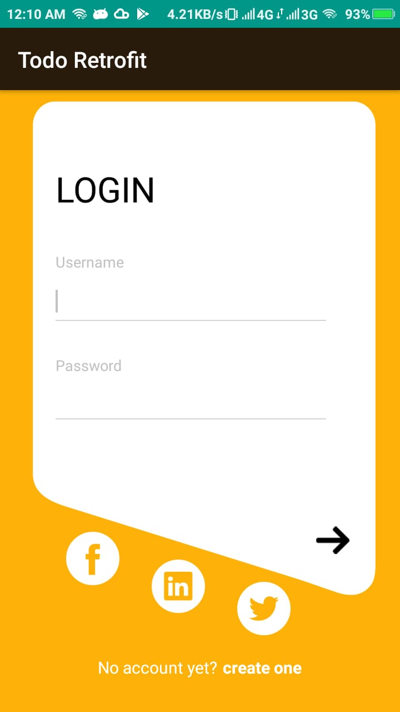

# Quiz 2

- Lengkapi project sehingga mempunyai fitur lengkap sebagai aplikasi Todo List!

  > Gunakan fitur backend REST yang telah disediakan

- Gunakan kreatifitas anda untuk memodifikasi layout sehingga menjadi aplikasi
 yang menarik!

## Deadline

  > Demokan project anda sebelum hari Jum'at tanggal 03 Mei 2019, dan kumpulkan
  > semua source code project anda sebelum tanggal 04 Mei 2019 01.00

# Tampilan Aplikasi

### Halaman awal Login

## Halaman Register

## Halaman Todo
- Ketika item Todo di klik

- Ketika item Todo yang sudah selesai di klik

## Tampilan Create Data
- menambahkan data

- Create berhasil :

## Tampilan Menu pada item

## Konfirmasi Delete

- jika delete berhasil

## Halaman Update

- data dirubah menjadi :

- update berhasil :

## Log out
